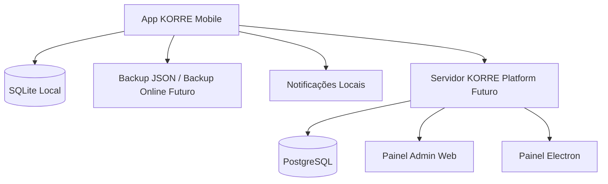

# 02. Arquitetura Geral

## Visão técnica
- App mobile offline-first (Expo + React Native + TypeScript).
- Persistência local em SQLite (`expo-sqlite`).
- Camadas por hooks, módulos, services e repositories.
- Notificações locais com deduplicação.

## Estrutura de pastas (alto nível)
- `app/`: rotas Expo Router.
- `components/`: UI reutilizável.
- `hooks/`: orquestração por tela/domínio.
- `modules/`: regras de negócio (fuel, índices, sync, backup online etc.).
- `database/`: init e migrações SQLite.
- `notifications/`: serviço e checkers de notificação.
- `services/`: fluxos transversais.
- `tests/`: testes unitários.

## Integração futura de plataforma
- Servidor KORRE Platform (NestJS + Postgres).
- Admin Web.
- Admin Electron.

## Implementado atualmente
- Camada local completa.
- Fundamentos de sync e backup online no app (fila local e guardas de consentimento).

## Planejado
- Handshake formal de device com servidor.
- Consolidação de contratos API e operação remota.

## Pendente
- Observabilidade central e governança operacional.

## Riscos e cuidados
- Processos em background no mobile são limitados por SO.
- Push deve apenas sinalizar, sem extração automática de dados.
